# QuoteVault CI/CD

A production-style CI/CD pipeline built around a lightweight Node.js REST API.
The focus of this project is not the app — it's the automated pipeline that
tests, containerizes, and deploys it on every push to main.

## Architecture



## Stack

| Layer | Technology |
|---|---|
| App | Node.js · Express |
| Tests | Jest · Supertest |
| Container | Docker (multistage build) |
| Registry | Docker Hub |
| CI/CD | GitHub Actions |
| Infrastructure | Terraform |
| Cloud | AWS EC2 (t3.micro) |

## API Endpoints

| Method | Endpoint | Description |
|---|---|---|
| GET | `/health` | Returns server health status |
| GET | `/getQuote` | Returns a random quote |
| POST | `/setQuote` | Adds a new quote to the store |

## Pipeline Flow

1. Push to `main` triggers GitHub Actions
2. CI stage installs dependencies and runs Jest tests
3. If tests pass — Docker image is built and pushed to Docker Hub
4. CD stage SSHs into EC2, pulls the latest image, and restarts the container
5. If tests fail — pipeline stops, nothing deploys

## Project Structure

```
quotevault-cicd/
├── .github/workflows/pipeline.yml   # CI/CD pipeline
├── app/
│   ├── src/
│   │   ├── routes/quotes.js         # Route handlers
│   │   ├── data/quotes.js           # In-memory store
│   │   ├── app.js                   # Express setup
│   │   └── server.js                # Entry point
│   ├── tests/quotes.test.js         # Jest tests
│   └── Dockerfile                   # Multistage build
└── terraform/
    ├── main.tf                      # EC2 + security group
    ├── variables.tf
    └── outputs.tf
```

## Run Locally

```bash
cd app
npm install
npm test       # run tests
npm start      # start server on :3000
```

## Run with Docker

```bash
cd app
docker build -t quotevault-cicd .
docker run -p 3000:3000 quotevault-cicd
```

## Infrastructure

EC2 instance provisioned with Terraform:

```bash
cd terraform
terraform init
terraform apply
```

## What I Learned

- How a real CI/CD pipeline gates deployments behind automated tests
- Multistage Docker builds to keep production images lean
- Provisioning cloud infrastructure with Terraform as code
- Storing secrets securely in GitHub Actions
- How SSH-based deployment works in practice